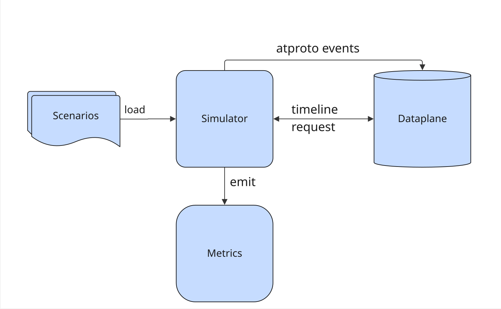
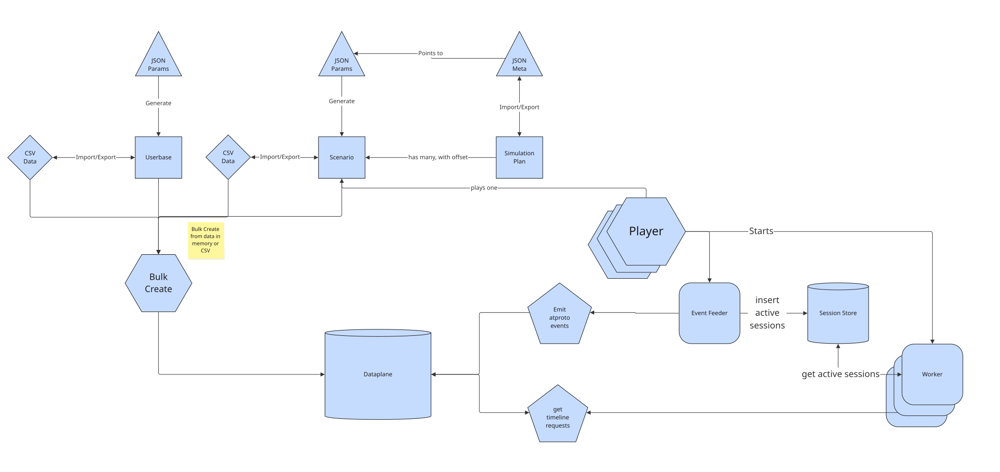
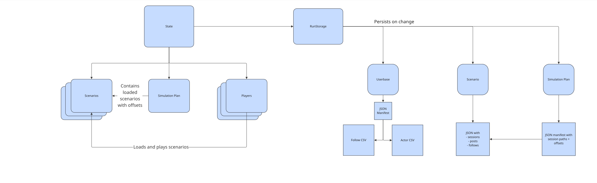

# Overview

This project simulates incoming traffic and user requests for an atproto dataplane such as the one used by bluesky.



It is a single user application.

Some features depend on the project being run on the same machine as the dataplane, in particular bulk creation of data which works by copying data directly from CSV files into the database.
Most features would also work with the dataplane on a different machine, as most of the functionality works via Websockets and HTTP requests. 

An important goal of this simulator project is to provide repeatable simulations.
For this reason, the complete data and runtime behavior of the simulator can be imported from files. 
Importing the same files will result in an identical simulation run.

When using the simulator interactively, it exports all important parameters for the run automatically, in order to provide the files for a repeatable run.

## Core Concepts

### Base Data

The base data defines the starting shape of the simulated network.
It describes the userbase that will exist before simulation playback begins.

The simulator currently supports creating users ("actors") and follows between those users as base data.

### Scenario

A scenario captures a series of user activity that will happen at defined time offsets during simulation.

At the moment three actions can be simulated:
- user creates a post
- user follows another user
- user requests their timeline

A single scenario can contain series for all three actions, but all of them are optional.

Scenarios are intended to represent typical real world traffic, for instance a regular "saturday morning", or you know, a "shitstorm".

### Simulation Plan

A simulation plan contains multiple scenarios that start at defined time offsets.

Example:
 ```elixir
simulation_plan = [
   %{scenario_name: "saturday morning", path: "saturday_morning.json", offset_ms: 0},
   %{scenario_name: "shitstorm", path: "shitstorm.json", offset_ms: 100_000}
]
```

In this example simulation plan, the simulator starts with traffic as defined in the "saturday morning" scenario.
At the offset of `100_000 ms`, it will additionally start simulating the traffic as defined in the "shitstorm" scenario.

Every simulation run follows a single simulation plan.

When you add scenarios interactively they will be included in the current simulation plan at the offset corresponding to the current runtime.
The simulation plan will then automatically be exported.
This way, you can always repeat your interactive simulator sessions.

## Workflow

At a high level, the system works in this order:

1. Define base data for a simulated user population.
2. Import a whole simulation plan, or generate or import individual scenarios.
3. Select which scenarios to run.
4. Load the scenarios into the simulation player.
5. Run the player to simulate traffic.
6. Observe simulation behavior through metrics exposed to Prometheus and Grafana.

## Architecture

The following diagram shows some more details about the architecture of the simulator.
We can find the concepts we explained before: base data (aka. userbase), scenario, and simulation plan.
Each of those has a representation in files.
We use JSON files to hold parameters and meta information, and CSV files to store actual data, for instance a list of user idsfor instance.



Userbase and scenarios can be bulk created to provide base data before running a simulation.
Bulk creation bypasses the network and writes directly into the dataplane to speed up data creation.

Scenarios can be played by a player.
Each player takes a single scenario and performs the actions specified by the scenario at the corresponding time offsets. 

As described above, you can run multiple scenarios at the same time.
In this case, the simulator starts a new player for each scenario.

As you can see in the diagram, the player starts other components.
Details about the player: [Player](./architecture/player.md)

## Application State

The simulator holds the available scenarios, the current simulation plan, and the current players as global state as shown in the diagram below.
Whenever the state changes through interactive use, the simulator will store corresponding files on disk, in order to provide a repeatable simulation run.



