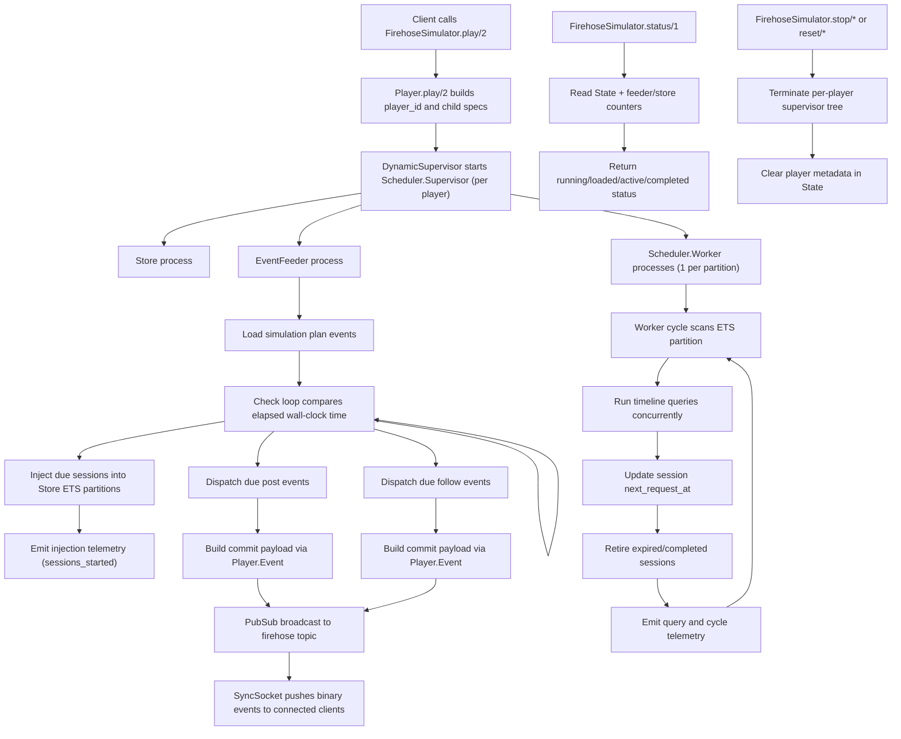

# Player

## Purpose

The player executes simulation plans in real time using per-run process trees with isolated scheduling and state.

## Modules

- `FirehoseSimulator.Player`
- `FirehoseSimulator.Scheduler.Supervisor`
- `FirehoseSimulator.Scheduler.Worker`
- `FirehoseSimulator.SimulationPlan.EventFeeder`
- `FirehoseSimulator.Store`
- `FirehoseSimulator.Session`
- `FirehoseSimulator.State`

## Public Entry Points

- `FirehoseSimulator.play/2`
- `FirehoseSimulator.play_with_offset/2`
- `FirehoseSimulator.play_with_offset/3`
- `FirehoseSimulator.stop/0`
- `FirehoseSimulator.stop/1`
- `FirehoseSimulator.reset/0`
- `FirehoseSimulator.reset/1`
- `FirehoseSimulator.status/1`
- `FirehoseSimulator.shift_simulation_plan/2`

## Parameters

### `play/2` Options

- `:scheduler_count` (default `System.schedulers_online()`)
- `:worker_max_concurrency` (optional positive integer override)
- `:simulation_plan_id` (optional metadata)

### Derived Runtime Parameters

- `request_interval_ms` comes from `%SimulationPlan{request_interval_ms}`; default `30_000` if nil.

## Runtime Behavior

1. `Player.play/2` creates a unique `player_id` and builds child specs.
2. `Scheduler.Supervisor` starts:
- one `Store`
- one worker per partition
- one `EventFeeder`
3. `EventFeeder` loads plan events, starts a check loop, injects due sessions into worker partitions, and emits due posts/follows as firehose commit payloads over PubSub.
4. Workers continuously scan their ETS partition, run timeline queries concurrently, update session `next_request_at`, and retire expired sessions.
5. Telemetry is emitted for injection, query, and cycle events.
6. `stop/*` and `reset/*` terminate per-player supervisors and clean `State` metadata.
7. `status/1` reports running state, loaded state, active/completed sessions, and feeder queue status.

