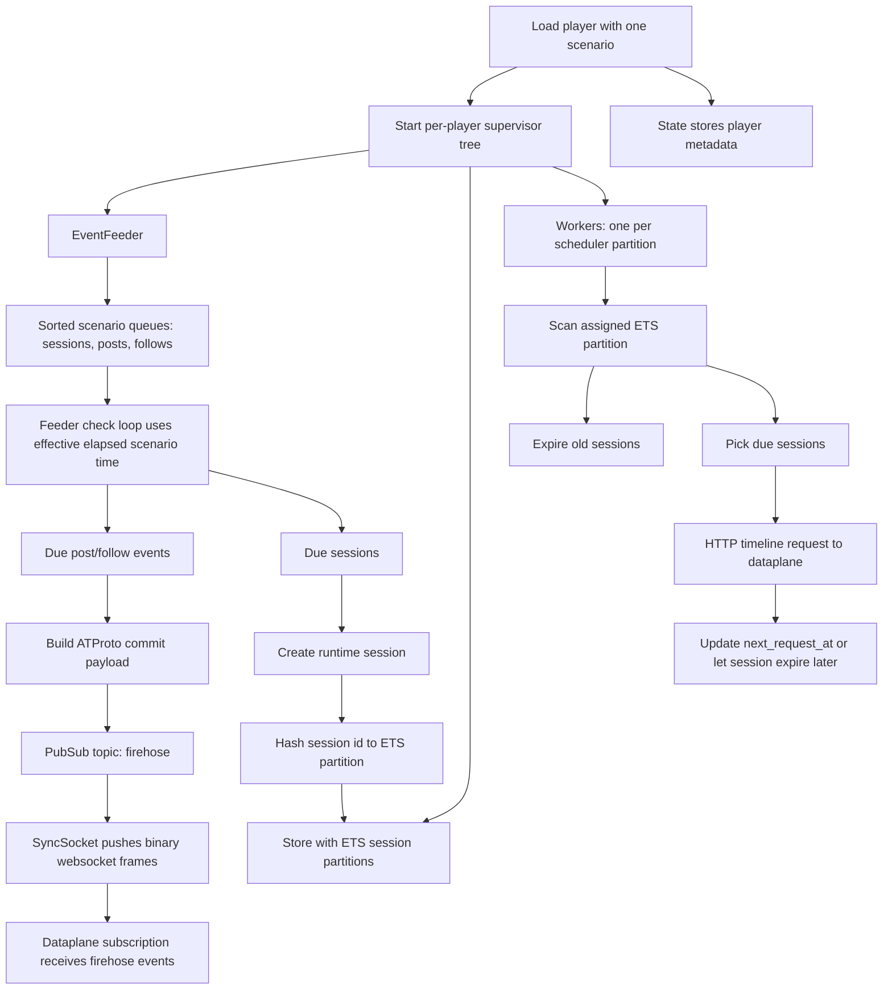
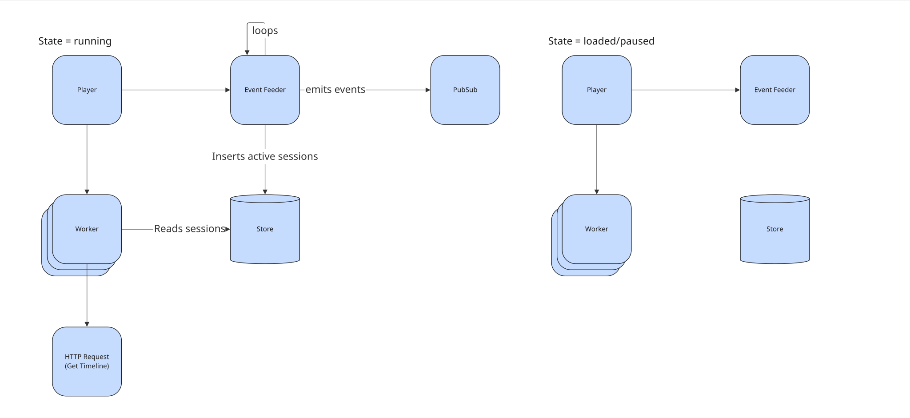

# Player

A player belongs to a single scenario for its whole lifetime.
The scenario is fixed when the player is created.
If you want to run a different scenario, create a new player.

## Runtime Model

Loading a player builds a dedicated runtime tree for that player:

- one `EventFeeder`
- one `Store`
- one worker per scheduler partition

Worker count comes from `scheduler_count` and defaults to `System.schedulers_online()`.

The player currently simulates three actions:

- create post: emitted as an ATProto firehose commit event
- follow user: emitted as an ATProto firehose commit event
- get timeline: executed as an HTTP request to the dataplane

## Runtime Flow

When a player is loaded, the event feeder receives the scenario and turns it into three sorted queues:

- sessions
- posts
- follows

Posts and follows are scheduled by scenario offset.
When they become due, the feeder builds commit payloads and broadcasts them via Phoenix PubSub.
A websocket process subscribes to the PubSub topic.
The dataplane then subscribes to the websocket to receive those events.

Sessions are handled differently.
When a session becomes due, the feeder creates a runtime session record and inserts it into one ETS partition in the player store.
The partition is chosen by hashing the session id and taking `rem(phash2(session_id), scheduler_count)`.
This keeps one worker responsible for each partition instead of every worker scanning the full session set.

Each session row stored in ETS includes:

| Field                 | Notes                                         |
| ---                   | ---                                           |
| `next_request_at`     | Timestamp for the next timeline request       |
| `expires_at`          | Timestamp when the session is expired         |
| `request_interval_ms` | Request interval for this session             |
| `user_id`             | The simulated user attached to the session    |
| `started_at`          | Timestamp when the runtime session was created|

Workers loop over their partition:

1. expire sessions whose `expires_at` is in the past
2. select sessions whose `next_request_at` is due
3. take a bounded batch of due sessions from that partition
4. run `GetTimeline` requests in parallel via `Task.async_stream`
5. write each session back with a new `next_request_at`

Expired sessions are removed from the active ETS table and counted in a separate completed table.

A worker scans its own ETS partition, then fans out the selected due sessions with `Task.async_stream(max_concurrency: state.max_concurrency)`.
That means each worker can issue multiple timeline requests concurrently while still keeping a fixed upper bound on in-flight requests.
The batch size is also capped to that same concurrency limit, so one worker cycle only pulls as many due sessions as it is prepared to execute in parallel.
Requests that time out are killed after 30 seconds and recorded as timeouts in telemetry.

## Player States

### Loaded, not started

Before starting a player, you must load a scenario.

- The player supervisor tree is already running.
- The event feeder has loaded and sorted the scenario queues.
- The store and workers exist, but workers are not processing yet.
- Player metadata is written into `State` with:
  - `lifecycle_state: :loaded`
  - `loaded_at`
  - `started_at: nil`
  - `paused_at: nil`
  - `total_paused: 0`
- No firehose events are emitted yet.
- No timeline requests are made yet.
- No runtime sessions are in ETS yet, because sessions are only materialized when the feeder starts advancing scenario time.

### Running

- Workers switch to `:running` and begin processing their ETS partitions.
- The event feeder switches to `:running` and starts its periodic check loop.
- On first start:
  - player metadata `started_at` is set
  - feeder `started_at` is set
  - paused fields are cleared
- Scenario offsets now advance.
- Due posts and follows are published onto PubSub and then to the firehose WebSocket.
- Due sessions are created and inserted into ETS partitions.
- Workers begin making timeline HTTP requests for due sessions and advance `next_request_at` after each request.

### Paused

- Player metadata moves to `:paused`.
- Player metadata `paused_at` is recorded.
- The event feeder records its own pause timestamp and stops advancing effective scenario time.
- Workers stop scheduling new work.
- Sessions already in ETS stay there.
- Pending scenario offsets for posts, follows, and future session starts are frozen while paused.

Timestamp behavior matters here:

- Player metadata timestamps use wall-clock time via `System.system_time/1`.
- Event feeder timing uses monotonic time and computes `effective_elapsed` by subtracting total paused time.
- Session rows in ETS keep absolute runtime timestamps for `next_request_at` and `expires_at`.
- Those ETS timestamps are not rewritten when the player is paused.

That means pause freezes scenario offset processing in the feeder, but it does not shift already-created session deadlines in ETS.

### Resumed

Paused players can be resumed.

- The scenario does not reload and does not change.
- Player metadata returns to `:running`.
- Player metadata keeps the original `started_at`.
- `paused_at` is cleared.
- `total_paused` is increased by the length of the pause.
- The event feeder also adds the pause duration to its own `total_paused`, so scenario offsets continue from where they stopped.

Offset handling after resume:

- posts/follows/session-start offsets continue from the paused scenario position
- feeder elapsed time excludes paused time
- no skipped scenario offsets are introduced by the pause itself

Session timestamp handling after resume:

- existing ETS sessions keep their original `next_request_at` and `expires_at`
- workers immediately see any sessions that became due while paused
- workers also immediately expire any sessions whose `expires_at` passed while paused

So resume preserves scenario offset position, but already-created runtime sessions still age according to their stored ETS timestamps.
